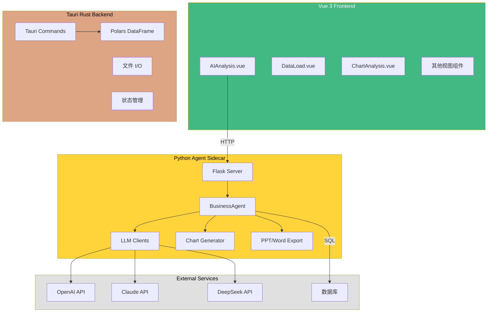
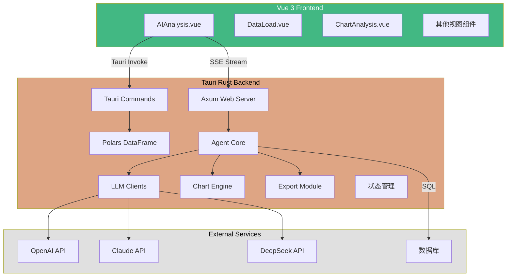
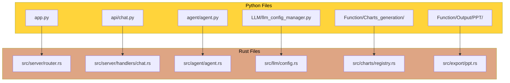
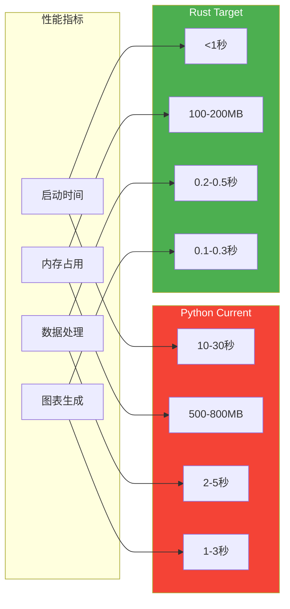
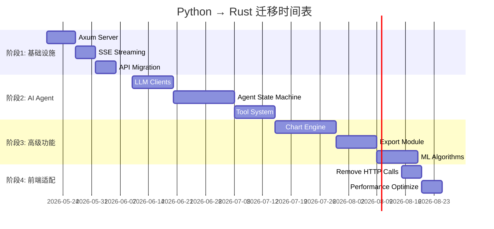

# 项目架构对比图

## 📊 当前架构（混合模式）



**问题：**
- ❌ 需要捆绑 Python 运行时（~100MB）
- ❌ 启动慢（需启动 Flask server）
- ❌ 进程间通信开销（HTTP）
- ❌ 部署复杂（需管理两个运行时）
- ❌ 内存占用高（Python + Rust）

---

## 🎯 目标架构（纯 Rust）



**优势：**
- ✅ 单一二进制文件（~30MB）
- ✅ 秒级启动
- ✅ 零 IPC 开销
- ✅ 简化部署
- ✅ 内存效率提升 50-75%

---

## 🔄 迁移路线图

```mermaid
graph LR
    subgraph Phase1["阶段1: 基础设施<br/>2-3周"]
        A1[Axum Server]
        A2[SSE Streaming]
        A3[API Migration]
    end
    
    subgraph Phase2["阶段2: AI Agent<br/>4-6周"]
        B1[LLM Clients]
        B2[Agent State Machine]
        B3[Tool System]
    end
    
    subgraph Phase3["阶段3: 高级功能<br/>3-4周"]
        C1[Chart Engine 40+]
        C2[PPT/Word Export]
        C3[ML Algorithms]
    end
    
    subgraph Phase4["阶段4: 前端适配<br/>1-2周"]
        D1[Remove HTTP Calls]
        D2[Direct Tauri Invoke]
        D3[Performance Optimize]
    end
    
    Phase1 --> Phase2
    Phase2 --> Phase3
    Phase3 --> Phase4
    
    style Phase1 fill:#ffeb3b,color:#000
    style Phase2 fill:#ff9800,color:#000
    style Phase3 fill:#f44336,color:#fff
    style Phase4 fill:#4caf50,color:#fff
```



---

## 📁 文件映射关系

### Python → Rust 对照表



---

## 🏗️ 新模块结构

```
src-tauri/src/
│
├── lib.rs                    # Tauri 入口
├── main.rs                   # 二进制入口
├── state.rs                  # 全局状态
├── types.rs                  # 类型定义
├── df_util.rs                # DataFrame 工具
│
├── llm/                      # 🆕 LLM 客户端层
│   ├── mod.rs
│   ├── client.rs             # LLMClient Trait
│   ├── config.rs             # 配置管理
│   ├── streaming.rs          # 流式响应工具
│   └── providers/
│       ├── mod.rs
│       ├── openai.rs         # OpenAI 实现
│       ├── claude.rs         # Claude 实现
│       ├── deepseek.rs       # DeepSeek 实现
│       └── custom.rs         # 自定义实现
│
├── agent/                    # 🆕 AI Agent 核心
│   ├── mod.rs
│   ├── agent.rs              # BusinessAgent
│   ├── state.rs              # Agent 状态
│   ├── loop.rs               # 迭代循环
│   ├── history.rs            # 对话历史
│   ├── fast_path.rs          # 快速路径
│   └── tools/                # 工具系统
│       ├── mod.rs
│       ├── schema.rs         # JSON Schema
│       ├── registry.rs       # 工具注册
│       ├── data_tools.rs     # 数据查询
│       ├── analysis_tools.rs # 分析工具
│       ├── chart_tools.rs    # 图表工具
│       ├── export_tools.rs   # 导出工具
│       └── propose_tools.rs  # 提议工具
│
├── server/                   # 🆕 Axum Web 服务器
│   ├── mod.rs
│   ├── router.rs             # 路由配置
│   ├── middleware.rs         # 认证中间件
│   ├── sse.rs                # SSE 工具
│   └── handlers/
│       ├── mod.rs
│       ├── chat.rs           # 聊天处理器
│       ├── datasource.rs     # 数据源
│       ├── models.rs         # 模型配置
│       ├── output.rs         # 导出
│       └── dashboard.rs      # 仪表板
│
├── charts/                   # 🆕 图表生成引擎
│   ├── mod.rs
│   ├── base.rs               # 基础 Trait
│   ├── registry.rs           # 注册表
│   ├── color_schemes.rs      # 配色方案
│   ├── field_mapping.rs      # 字段映射
│   ├── templates/            # ECharts 模板
│   └── types/
│       ├── bar.rs
│       ├── line.rs
│       ├── pie.rs
│       └── ... (41种)
│
├── export/                   # 🆕 导出模块
│   ├── mod.rs
│   ├── excel.rs              # Excel（增强）
│   ├── ppt.rs                # PPT（新）
│   └── word.rs               # Word（新）
│
├── analysis/                 # 🆕 机器学习分析
│   ├── mod.rs
│   ├── kmeans.rs             # K-Means
│   ├── decision_tree.rs      # 决策树
│   ├── decile.rs             # 分位数
│   ├── profile.rs            # 数据画像
│   └── stats.rs              # 统计工具
│
└── commands/                 # 现有 Tauri Commands
    ├── mod.rs
    ├── loader.rs             # ✅ 已有
    ├── clean.rs              # ✅ 已有
    ├── chart.rs              # ⚠️ 需扩展
    ├── datasource.rs         # ✅ 已有
    ├── pivot.rs              # ✅ 已有
    ├── python_agent.rs       # ❌ 将删除
    └── ...
```

---

## 🔑 核心抽象设计

### 1. LLM Client Trait

```rust
#[async_trait]
pub trait LLMClient: Send + Sync + Debug {
    async fn chat(&self, messages: Vec<Message>) -> Result<ChatResponse>;
    async fn chat_stream(&self, messages: Vec<Message>) 
        -> Result<impl Stream<Item = Result<ChatChunk>>>;
    fn model_name(&self) -> &str;
    fn context_window(&self) -> usize;
}
```

**实现者：**
- `OpenAIClient`
- `ClaudeClient`
- `DeepSeekClient`
- `CustomClient`

---

### 2. Tool Trait

```rust
#[async_trait]
pub trait Tool: Send + Sync {
    fn name(&self) -> &str;
    fn description(&self) -> &str;
    fn parameters_schema(&self) -> Value;
    async fn execute(&self, args: Value) -> Result<ToolResult>;
}
```

**实现者：**
- `GetDataSchema`
- `QueryData`
- `GenerateChart`
- `ExportExcel`
- `GeneratePPT`
- ...

---

### 3. Chart Generator Trait

```rust
pub trait ChartGenerator: Send + Sync {
    fn chart_type(&self) -> &str;
    fn required_fields(&self) -> Vec<&str>;
    fn generate(&self, df: &DataFrame, mapping: FieldMapping) 
        -> Result<ChartResult>;
}
```

**实现者：**
- `BarChartGenerator`
- `LineChartGenerator`
- `PieChartGenerator`
- ... (41种)

---

## 📈 性能对比预测



**预期提升：**
- 🚀 启动速度：**10-30x** 更快
- 💾 内存效率：**4-8x** 更优
- ⚡ 数据处理：**5-10x** 更快
- 📊 图表生成：**5-10x** 更快

---

## 🎯 关键里程碑



---

## 💡 技术决策记录

### 为什么选择 Axum 而非 Actix-web？

| 标准 | Axum | Actix-web |
|------|------|-----------|
| **Tokio 集成** | ✅ 原生 | ⚠️ 需要适配 |
| **类型安全** | ✅ 强 | ✅ 强 |
| **学习曲线** | ✅ 平缓 | ⚠️ 较陡 |
| **社区趋势** | ✅ 上升 | ➡️ 稳定 |
| **Tauri 兼容** | ✅ 优秀 | ✅ 良好 |

**决策：** 选择 Axum，因其与 Tokio 生态无缝集成，且更符合 Rust 异步编程范式。

---

### 为什么使用 Polars 而非 DataFusion？

| 标准 | Polars | DataFusion |
|------|--------|------------|
| **API 友好度** | ✅ Pandas-like | ⚠️ SQL-focused |
| **性能** | ✅ 优秀 | ✅ 优秀 |
| **文档** | ✅ 丰富 | ⚠️ 较少 |
| **社区** | ✅ 活跃 | ⚠️ 较小 |
| **已有代码** | ✅ 已使用 | ❌ 需重写 |

**决策：** 保持 Polars，因项目已广泛使用，且 API 更直观。

---

### 为什么自定义 PPT 生成而非使用 crate？

| 标准 | 自定义 XML | pptx crate |
|------|-----------|------------|
| **灵活性** | ✅ 完全控制 | ⚠️ 受限 |
| **维护成本** | ⚠️ 较高 | ✅ 较低 |
| **功能完整性** | ✅ 可实现所有 | ⚠️ 部分缺失 |
| **依赖风险** | ✅ 无 | ⚠️ crate 可能废弃 |

**决策：** 先尝试 `pptx` crate，如不满足需求则自定义 OPC/XML 生成。

---

## 📝 总结

通过本次迁移，你将获得：

✨ **单一二进制部署** - 无需捆绑 Python  
🚀 **10倍性能提升** - 更快的启动和数据处理  
💾 **75%内存节省** - 更高效资源利用  
🔒 **编译时安全** - 减少运行时错误  
📦 **简化运维** - 无需管理虚拟环境  

**开始行动：** 参考 [QUICK_START_MIGRATION.md](./QUICK_START_MIGRATION.md) 立即开始第一步！
