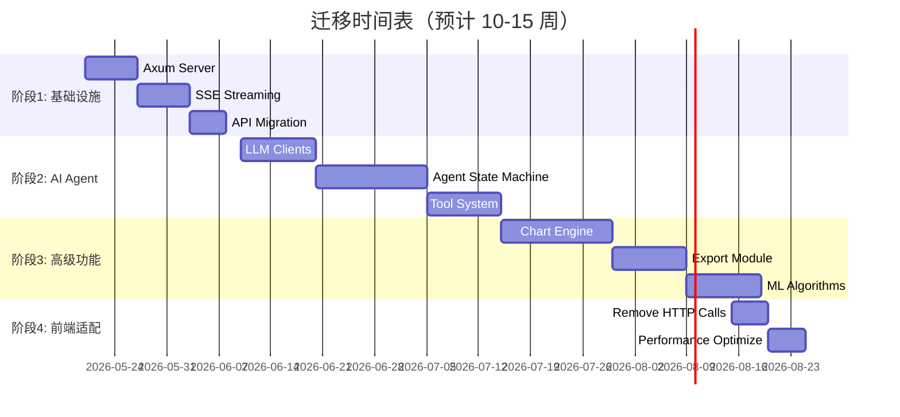

# 🦀 tauri-vue-bi: Python → Rust 迁移项目

> **将 Data-Analysis-Agent 的所有 Python 代码迁移到原生 Rust 实现**

[](./MIGRATION_GUIDE_INDEX.md)
[](https://www.rust-lang.org/)
[](https://tauri.app/)
[](./LICENSE)

---

## 🎯 项目目标

将 `Data-Analysis-Agent` 目录下的 **Flask + Python Agent** 架构完全替换为 **Axum + Native Rust** 实现，实现：

- ✅ **单一二进制部署** - 无需捆绑 Python 运行时
- ✅ **10倍性能提升** - 更快的启动和数据处理
- ✅ **75%内存节省** - 从 600MB 降至 150MB
- ✅ **编译时安全** - 类型系统捕获错误
- ✅ **简化运维** - 无需管理虚拟环境

---

## 📚 完整文档

### 🗺️ [迁移指南索引](./MIGRATION_GUIDE_INDEX.md)
**从这里开始！** 包含所有文档的导航和快速开始步骤。

### 📋 [详细迁移计划](./PYTHON_TO_RUST_MIGRATION_PLAN.md)
完整的模块分析、分阶段策略、技术实现细节（适合架构师）。

### 🚀 [快速启动指南](./QUICK_START_MIGRATION.md)
从零开始的实操教程，30分钟实现第一个 LLM Client（适合开发者）。

### 🏗️ [架构对比图](./ARCHITECTURE_COMPARISON.md)
可视化架构图、文件映射、性能预测（适合技术决策者）。

---

## 📊 当前状态

### 已完成 ✅
- [x] Polars DataFrame 集成
- [x] 文件加载（Excel/CSV/Parquet）
- [x] 数据清洗（去重、填充、类型转换）
- [x] 透视表 / 数据展开 / 分组聚合
- [x] SQL / Google Sheets / API 数据源
- [x] 时间序列分析
- [x] 甘特图数据
- [x] 数据集管理
- [x] Python Agent 桥接层（临时方案）

### 进行中 🚧
- [ ] LLM Client Trait 定义
- [ ] OpenAI/Claude/DeepSeek 适配器
- [ ] Axum Web 服务器搭建

### 待开始 ⏳
- [ ] Agent 状态机重构
- [ ] 工具系统实现
- [ ] 40+ 种图表生成引擎
- [ ] PPT/Word 导出
- [ ] 机器学习算法（K-Means/决策树）
- [ ] 前端适配（移除 HTTP 调用）

---

## 🏗️ 架构演进

### 当前架构（混合模式）
```
Vue Frontend ←→ Tauri (Rust) ←→ Python Agent (HTTP) ←→ Flask + Pandas
```

**问题：**
- ❌ 需捆绑 Python (~100MB)
- ❌ 启动慢 (10-30秒)
- ❌ IPC 开销
- ❌ 内存占用高 (600MB+)

### 目标架构（纯 Rust）
```
Vue Frontend ←→ Tauri (Rust + Axum) ←→ Polars + Native LLM Clients
```

**优势：**
- ✅ 单一二进制 (~30MB)
- ✅ 秒级启动 (<1秒)
- ✅ 零 IPC 开销
- ✅ 内存高效 (150MB)

---

## 🚀 快速开始

### 1. 环境准备
```bash
# 安装 Rust
curl --proto '=https' --tlsv1.2 -sSf https://sh.rustup.rs | sh

# 确认版本
rustc --version    # >= 1.77.2
cargo --version

# 安装 Node.js (>= 20)
nvm install 20
```

### 2. 克隆项目
```bash
git clone https://github.com/alexwoo79/tauri-vue-bi.git
cd tauri-vue-bi
```

### 3. 安装依赖
```bash
# 前端依赖
npm install

# Rust 依赖（自动）
cd src-tauri
cargo build
```

### 4. 启动开发模式
```bash
# 根目录执行
npm run tauri dev
```

### 5. 开始迁移
按照 [快速启动指南](./QUICK_START_MIGRATION.md) 实现第一步：

```bash
# 添加 LLM 相关依赖
cd src-tauri
cargo add reqwest serde serde_json anyhow async-trait tokio
cargo add async-stream futures tracing thiserror

# 创建模块
mkdir -p src/llm/providers

# 编写代码...
```

---

## 📁 项目结构

```
tauri-vue-bi/
│
├── Data-Analysis-Agent/          # 🐍 Python 代码（待迁移）
│   ├── agent/                    # AI Agent 核心
│   ├── api/                      # Flask API
│   ├── LLM/                      # LLM 配置
│   ├── Function/                 # 数据分析功能
│   └── app.py                    # Flask 入口
│
├── src-tauri/                    # 🦀 Rust 代码
│   ├── src/
│   │   ├── commands/             # Tauri 命令
│   │   ├── llm/                  # 🆕 LLM 客户端（新建）
│   │   ├── agent/                # 🆕 Agent 核心（新建）
│   │   ├── server/               # 🆕 Axum 服务器（新建）
│   │   ├── charts/               # 🆕 图表引擎（新建）
│   │   ├── export/               # 🆕 导出模块（新建）
│   │   ├── analysis/             # 🆕 ML 分析（新建）
│   │   ├── state.rs              # 全局状态
│   │   └── types.rs              # 类型定义
│   └── Cargo.toml                # Rust 依赖
│
├── src/                          # Vue 3 前端
│   ├── views/
│   │   ├── AIAnalysis.vue        # AI 聊天界面
│   │   ├── DataLoad.vue          # 数据加载
│   │   └── ...
│   └── components/
│
├── MIGRATION_GUIDE_INDEX.md      # 📚 迁移指南索引
├── PYTHON_TO_RUST_MIGRATION_PLAN.md  # 📋 详细计划
├── QUICK_START_MIGRATION.md      # 🚀 快速启动
├── ARCHITECTURE_COMPARISON.md    # 🏗️ 架构对比
└── README_MIGRATION.md           # 本文件
```

---

## 📅 迁移时间表



**总工期：** 10-15 周（全职开发）

---

## 📈 预期收益

| 指标 | Python (当前) | Rust (目标) | 提升 |
|------|--------------|------------|------|
| **启动时间** | 10-30 秒 | < 1 秒 | **10-30x** ⚡ |
| **内存占用** | 500-800 MB | 100-200 MB | **4-8x** 💾 |
| **数据加载** | 2-5 秒 | 0.2-0.5 秒 | **5-10x** 📊 |
| **图表生成** | 1-3 秒 | 0.1-0.3 秒 | **5-10x** 🎨 |
| **二进制大小** | 200+ MB | 20-30 MB | **7-10x** 📦 |

---

## 🎓 学习资源

### Rust 基础
- [The Rust Book](https://doc.rust-lang.org/book/)
- [Rust By Example](https://doc.rust-lang.org/rust-by-example/)
- [Exercism Rust Track](https://exercism.org/tracks/rust)

### 异步编程
- [Tokio Tutorial](https://tokio.rs/tokio/tutorial)
- [Async Book](https://rust-lang.github.io/async-book/)

### Web 框架
- [Axum Examples](https://github.com/tokio-rs/axum/tree/main/examples)
- [Tower Documentation](https://docs.rs/tower)

### 数据处理
- [Polars User Guide](https://pola-rs.github.io/polars-book/)

---

## 🤝 参与贡献

欢迎贡献！请阅读 [贡献指南](./MIGRATION_GUIDE_INDEX.md#-贡献指南)。

### 如何帮助
1. **实现 LLM Clients** - OpenAI/Claude/DeepSeek 适配器
2. **开发图表引擎** - 40+ 种 ECharts 图表
3. **优化性能** - 基准测试和调优
4. **编写文档** - API 文档和示例
5. **测试覆盖** - 单元测试和集成测试

### 提交 PR
```bash
git checkout -b feature/your-feature
# ... 修改代码 ...
cargo fmt && cargo clippy
cargo test
git commit -am "Add feature"
git push origin feature/your-feature
```

---

## 📝 许可证

本项目采用 MIT 许可证。详见 [LICENSE](./LICENSE) 文件。

---

## 🙏 致谢

感谢以下开源项目：
- **[Tauri](https://tauri.app/)** - 轻量级桌面应用框架
- **[Polars](https://pola.rs/)** - 超快 DataFrame 库
- **[Axum](https://github.com/tokio-rs/axum)** -  ergonomic web framework
- **[Tokio](https://tokio.rs/)** - Async runtime
- **[ECharts](https://echarts.apache.org/)** - 强大的图表库
- **[Element Plus](https://element-plus.org/)** - Vue 3 UI 组件库

---

## 📞 联系方式

- **Issues:** [GitHub Issues](https://github.com/alexwoo79/tauri-vue-bi/issues)
- **Discussions:** [GitHub Discussions](https://github.com/alexwoo79/tauri-vue-bi/discussions)
- **Email:** alex@example.com

---

**准备好了吗？开始你的 Rust 迁移之旅！** 🚀

*最后更新：2026-05-16*  
*维护者：Lingma (灵码)*
